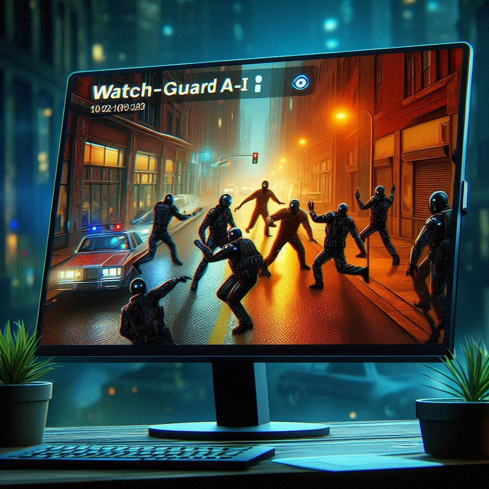

# <div align="center">WATCH-GUARD-AI: Surveillance and Suspicious Activity Detection using LCRN</div>
<div align="center">
  
</div>

## Table of content
--------------
1. [Introduction](#introduction)
2. [Features](#features)
4. [Installation and Customization](#installation-and-customization)
4. [Tools and  techniques used](#tools-and-techniques-used)
5. [Contribution](#contribution)

## Introduction
---------------
WATCH-GUARD-AI is a surveillance system designed to detect suspicious activities in video footage. Utilizing advanced deep learning techniques, the system can identify actions such as fighting, running, walking, boxing and more..., enabling real-time monitoring and alerting for enhanced security measures.

The project leverages the LCRN model (Long-term Recurrent Convolutional Networks) for activity recognition, combined with a user-friendly interface built with Streamlit. The system is capable of processing uploaded videos, performing predictions, and displaying the results directly on the video.

This project was developed as part of an effort to explore the potential of AI in enhancing security systems. For more details and source code, visit the project's GitHub page.

## Features
-----------
- **Customizable**: Train the model on your own dataset.
- **Multiple Models**: Utilizes LCRN architectures.
- **User-Friendly**: Clear instructions and a simple workflow.
- **Interactive**: Streamlit application for easy interaction with the model.

## Installation and Customization
---------------------------------
1. Clone the repository:
    ```bash
    git clone https://github.com/Aman-Vishwakarma1729/WatchGuard-AI
    ```
2. Navigate to the project directory:
    ```bash
    cd WatchGuard-AI
    ```
3. Install the required packages
    ```bash
    pip install -r requirements.txt
    ```
4. In the data folder upload your own data.
* Make sure your folder name should represents the class of video stock it contains.
* As that class name will be used for supervised modl training.

5. Clean the folders
* Delet all the models in model folder if your training yours to prevent any error.

7. Train the model
    ```bash
    python run model_trainer_main.py
    ```
* While training you can reffer log file generated in log folder with current time stamp and date name to see whats happening while training and also to debug.
* Also you can check out prediction_main.py to see how prediction pipeline works.

8. run streamlit application
    ```bash
    streamlit run application.py
    ```
## Tools and  techniques used
-----------------------------
* Deep Computer Vision
* LCRN
* Image Data Augmentation
* Model Optimization
* Tensorflow
* Scikit-learn
* Keras
* Python
* Modular Coding
* Neural Networks

## Contribution
---------------
* Feel free to contribute to this project by submitting issues or pull requests. Any feedback or suggestions are welcome!

